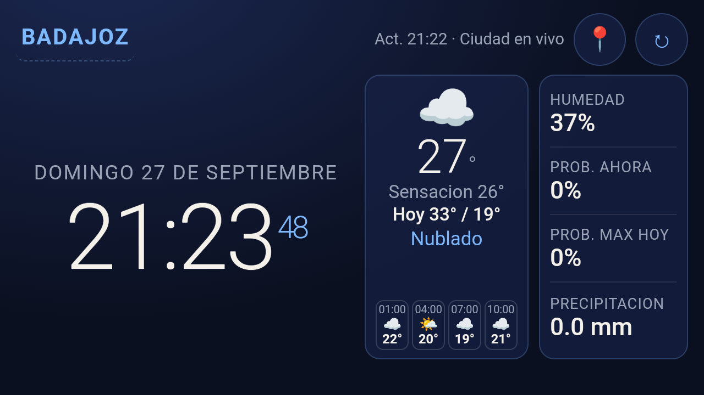

# ClimaDesk

**Dale una segunda vida a ese móvil que ya no usas.**

ClimaDesk convierte un smartphone antiguo en un **dashboard de escritorio**: reloj permanente a pantalla completa, con el clima de tu ubicación (o de la ciudad que elijas). Sin cuentas, sin publicidad y sin depender de un PC.

Pensado para dejarlo apoyado en la mesa, cargando, y echarle un vistazo de un golpe de ojo: hora, fecha, temperatura, sensación térmica y un mini-pronóstico.



---

## ¿Para qué sirve?

Muchos dispositivos Android viejos siguen siendo perfectamente válidos… si les das un propósito claro. ClimaDesk es ese propósito:

- **Reloj de mesa** siempre encendido
- **Clima local** actualizado en segundo plano
- **Kiosk sencillo**: interfaz inmersiva, sin distracciones
- **Autónomo**: solo necesita Wi‑Fi (o datos) e internet

Ideal para el despacho, la cocina, el taller o cualquier rincón donde quieras un reloj útil de verdad.

---

## Características

| | |
|---|---|
| 🕐 | Reloj grande con fecha en español |
| 🌤️ | Clima actual vía [Open-Meteo](https://open-meteo.com/) |
| 📍 | Ubicación automática (GPS / Wi‑Fi / red) |
| 🏙️ | O escribe una ciudad a mano |
| ↻ | Actualización manual y automática (~30 min) |
| 📶 | Si no hay red, muestra el **último dato guardado** |
| 🌓 | Tema día / noche según la hora |
| 🔮 | Mini-pronóstico de las próximas horas |

---

## Requisitos

- Android **5.0+** (API 21); probado también en Android 7 / MIUI
- Conexión a internet para el clima
- Permiso de ubicación (opcional; si lo deniegas, puedes fijar una ciudad)

No hace falta Google Play Services para el clima: la app habla directamente con Open-Meteo.

---

## Uso rápido

1. Instala el APK en el dispositivo.
2. Concede **ubicación** si quieres detección automática.
3. Deja la pantalla encendida (idealmente con el cargador conectado).

### Usar como reloj de mesa (kiosk)

Desde **v1.8**, ClimaDesk puede ser tu **launcher (Home)** y abrirse tras reiniciar el móvil. En MIUI hace falta permitir **Autostart**; no hay pantalla de configuración dentro de la app.

**Activar**

1. Instala o actualiza ClimaDesk.
2. MIUI: **Seguridad → Autostart** → permitir ClimaDesk.
3. Pulsa **Home** → elige **ClimaDesk** → **Siempre**.

**Quitar**

1. **Ajustes → Apps → ClimaDesk → Abrir de forma predeterminada** → borrar defaults (o elige el launcher del sistema al pulsar Home).
2. Desactiva Autostart de ClimaDesk.
3. O desinstala la app.

Más detalle en [HANDOFF.md](HANDOFF.md) y en `docs/superpowers/specs/2026-09-28-kiosk-hard-design.md`.

### Gestos útiles

- **📍** — forzar ubicación automática  
- **↻** — refrescar el clima ahora  
- **Tocar el nombre de la ciudad** — elegir ciudad manualmente  
- **Pulsación larga en la fecha** — ajustar el tamaño de la interfaz  

---

## Compilar

El código Android está en `kiosk-app/`.

```bash
cd kiosk-app
./gradlew assembleDebug
```

En Windows:

```bat
cd kiosk-app
gradlew.bat assembleDebug
```

El APK queda en:

`kiosk-app/app/build/outputs/apk/debug/app-debug.apk`

---

## Privacidad

- No hay cuentas ni telemetría propia.
- La ubicación y el clima se consultan a APIs públicas de Open-Meteo.
- La ciudad elegida y el último parte se guardan solo en el dispositivo (`localStorage` del WebView).

---

## Roadmap

| Prioridad | Qué | Estado |
|-----------|-----|--------|
| Hecho | Reloj + clima kiosk, GPS/ciudad, offline, día/noche, mini-pronóstico | ✅ v1.6 |
| Hecho | Selector de ciudad con búsqueda (sin `prompt`) | ✅ |
| Hecho | Package / `applicationId` → `es.climadesk.app` | ✅ v1.7 |
| Hecho | Icono propio reloj+sol (adaptive + legacy) | ✅ |
| Hecho | Kiosk duro: Home + autoarranque (MIUI) | ✅ v1.8 |
| Siguiente | Modo solo-reloj | Pendiente (P2) |
| Luego | APK release firmada + tag en GitHub | Aplazado (P3-B, sin keystore aún) |

Estado de desarrollo más detallado: [HANDOFF.md](HANDOFF.md).

---

## Licencia

Apache License 2.0 — ver [LICENSE](LICENSE).

---

*Un móvil viejo no tiene por qué acabar en un cajón. Puede ser el mejor reloj de tu escritorio.*
